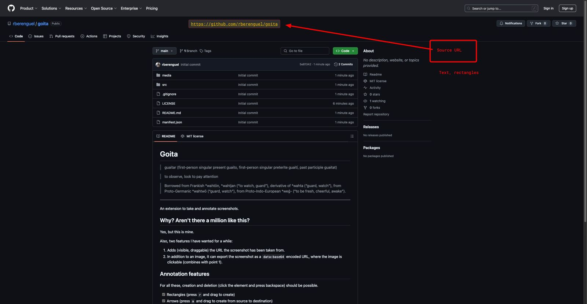

# Goita

> guaitar (first-person singular present guaito, first-person singular preterite guaití, past participle guaitat)

> to observe, look
> to pay attention

> Borrowed from Frankish *wahtōn, *wahtjan (“to watch, guard”), derivative of *wahta (“guard, watch”), from Proto-Germanic *wahtwō (“guard, watch”), from Proto-Indo-European \*weǵ- (“to be fresh, cheerful, awake”).

---

An extension to take and annotate screenshots.

## Why? Aren't there a million like this?

Yes, but this is mine.

Also, two features I have wanted for a while:

1. Adds (visible, draggable) the URL the screenshot has been taken from. On a Mac, that is enough to go back to the source.

2. In addition to an image, **it can export the screenshot as a `data:base64` encoded URL**, where the image is clickable (combines with point 1). I can't embed an example in a README (github seems to throw such a long URL away) but you can find it in [`media/data-url-example`](https://raw.githubusercontent.com/rberenguel/goita/refs/heads/main/media/data-url-examplee), copy that blob of text in the URL of your browser (tested in Chrome and Safari) and you should see a screenshot as the one above, clickable.

## Annotation features

For all these, creation and deletion (click the element and press backspace) should be possible.

- [x] Rectangles (press `r` and drag to create)
- [x] Arrows (press `a` and drag to create from source to destination)
- [x] Text (press `t` and click to place)
- [ ] Highlight
- [ ] Redact
- [ ] Circles/ellipses

I think there is an interaction mode I forgot to set up.

## Installation

Download/clone this repository somewhere and load the extension in Chrome via `Extensions -> Load unpacked`. I only could get it to fully work once I enabled "enable in Incognito". If you don't feel like doing that, that's okay. I wrote this for my own use anyway…

## Credits

- Icon: Gemini via Imagen 3.
- Gemini helped fight with Chrome permissions, but I ended up having to read (again) too much of its documentation.
