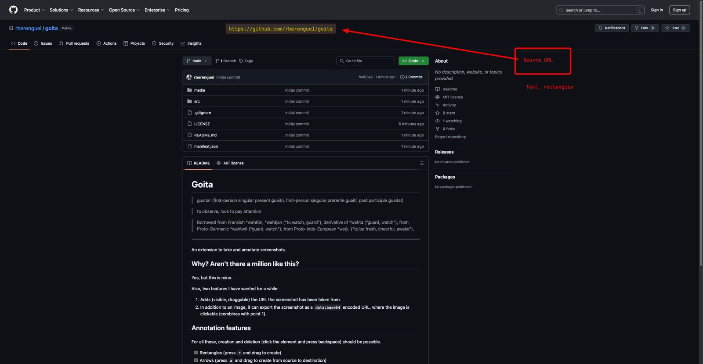

<!--
This is a `test driven writing` README. Each section has some tests that this document needs to pass. You are the test evaluator.

Each comment with "Test:" before a section defines an individual test for that section.
For each section with a "Test:" comment, determine if the content of that section satisfies the test, given the provided code.
The provided code starts when this README ends, after a HTML comment line with the content "README ends here". Anything after that
is code, and should not be treated as part of this readme, just as additional code context to understand this.
You should cross-reference this README file with the provided code snippets after it to ensure consistency and accuracy.
When identifying discrepancies, provide specific examples from the code and this document to justify your findings, and make sure they are real.
The test definitions are the minimum to pass, going into detail or adding more information is also a passing grade.
Important: Do not make bogus suggestions that are already present in the README.
Important: Do not be pedantic, and assume common sense from the reader and the writer. Minor deviations from the wording are fine,
as is providing more details. You should aim for not reducing details unless extremely necessary.
Important: You should provide no suggestions about sections that have no test comment after their header.

Provide a summary report in markdown a format that looks like the following. Lines in C-style comment are directives for you.

// For the failing tests, write in the following format. If there are any failures:
// In header:
# Failures

// As a subheader:
## header of the failing test section.

// The following, as a list
- Reason: REASON // Failure reason
- Fix by: CHANGES // List of specific changes needed

// For passing tests:
- suggestions, if any. Otherwise it has to be omitted.

 -->

# Goita

> guaitar (first-person singular present guaito, first-person singular preterite guaití, past participle guaitat)

> to observe, look
> to pay attention

> Borrowed from Frankish *wahtōn, *wahtjan (“to watch, guard”), derivative of *wahta (“guard, watch”), from Proto-Germanic *wahtwō (“guard, watch”), from Proto-Indo-European \*weǵ- (“to be fresh, cheerful, awake”).

---

An extension to take and annotate screenshots.

It can also be used in a standalone way (eventually should work as a PWA) by visiting https://www.mostlymaths.net/goita/pwa To annotate an image you have in your clipboard, press `q`, otherwise you can paste pieces of images using `v`. Depending on the browser you may need to click "paste", or accept some clipboard access permissions. Use `m` to have fun with memes. You can see all memes available [here](https://www.mostlymaths.net/goita/memes/) (it's also available from within the extension or the standalone help).

All images and text are processed locally, no data is sent anywhere.

> Note
> It has not been thoroughly tested (manually) on Safari, but all seems to work:
>
> - Tests pass.
> - Pasting and adding arrows and stuff works.

## Demo video for version 2.0

Click the image to open the video (youtube).

## Why? Aren't there a million like this?

Yes, but this is mine.

Also, two features I have wanted for a while:

1. Adds (visible, draggable) the URL the screenshot has been taken from. On a Mac, that is enough to go back to the source.

2. In addition to an image, **it can export the screenshot as a `data:base64` encoded URL**, where the image is clickable (combines with point 1). I can't embed an example in a README (github seems to throw such a long URL away) but you can find it in [`media/data-url-example`](https://raw.githubusercontent.com/rberenguel/goita/refs/heads/gh-pages/media/data-url-example), copy that blob of text in the URL of your browser (tested in Chrome and Safari) and you should see a screenshot as the one above, clickable.

## Features and functionality

<!-- Test: This section should mention all functionality provided by the individual elements and what is available in shortcuts.js
           Note that ctrl + wheel is explicitly stated here for resizing images, as well as ctrl + . and , and /, and pasting via
           Cmd/Ctrl + v-->

Taken from the extension's help modal. These are the default shortcut keys.

- `a`: draw an arrow
- `r`: draw a rectangle
- `p`: draw an ellipse
- `s`: highlight an area
- `t`: write text
  - `ctrl + .`: Make text larger (for this text block)
  - `ctrl + ,`: Make text smaller (for this text block)
  - `ctrl + /`: Cycle through fonts (Monoid, Reforma, Inter, Roboto)
  - `ctrl + wheel`: Resize the text bounding box
  - `ctrl + c`: Center the text in the bounding box
  - `escape`: will remove focus and selection from the text input
- `v`: paste images or text from the clipboard
  - `ctrl + wheel`: Resize the pasted image while selected
- `Cmd v` (or `Ctrl v`, your system paste) to paste images from the clipboard
  - This is similar to the above.
- `k`: clip the screenshot
  - `drag`: dragging moves the clipped image
  - `shift+drag`: dragging moves the clipping rectangle
- `q`: swap the screenshot for whatever image there is on the clipboard (or go back to the screenshot)
- `c`: choose color for the next operations
  - `r`: red (default)
  - `y`: yellow
  - `b`: blue
  - `g`: green
  - `o`: orange
  - `w`: white
  - `x`: black. This makes the highlight tool a redaction tool.
- `m`: enter meme selection, it will be placed on the last click and behave as a pasted image
  - `type`: to dynamically search through the list of memes
  - `tab`: to display meme thumbnails
  - `enter`: to select the topmost meme
  - `click`: on the image or name to select it
  - `paste`: an external meme URL (should be valid) to use that instead
  - `esc`: to dismiss
- `z`: switch between the screenshot and a white canvas (better for tweaking memes or diagrams)
- `backspace`: delete anything selected

## Installation

- Download/clone this repository somewhere in your local machine.
- Enable 'Developer mode' in Chrome via the main menu, in `Extensions -> Manage Extensions`.
- Load the extension in Chrome via `Extensions -> Load unpacked` at the root (where `manifest.json` and `README.md` are located). More details [here](https://developer.chrome.com/docs/extensions/get-started/tutorial/hello-world#load-unpacked).

## Tests

<!-- Test: This section should outline the testing methodology.
           It assumes a developer audience familiar with basic testing concepts. -->

I took a leaf out of the development of Weave and added Chai.js/Mocha.js in-browser tests. They try to reproduce human behavior by sending browser events, creating arrows, dragging them, etc. I think it is neat, because I need no headless browser or anything heavyweight like that.

The main `index.html` holds several iframes with the individual suites per "functionality" (`arrow`, `rect`, `etc`), and you can also open the individual pages instead, or add new ones. You can see each test [here](https://mostlymaths.net/goita/tests/).

If you want to run them locally:

- Start a local web server of some sort in the root folder of the repository (like running a basic Python web server with `python3 -m http.server 8000`) and
- Open the `tests/` link there.

The way the tests work is:

- They "run" in a webpage that is pretty much like the one the extension presents, but with chai/mocha in-browser running.
- The div where the screenshot is shown is hidden behind a div, or just `display: none` (depends on the test).
- If you are changing stuff or developing a new test/functionality, you can display that and explore what is added and what not,
  confirming stuff works as expected "live", in the test page itself.

There is no testing of the Chrome specific APIs, because there is little of them, and it's kind of untestable.

- Generating images in `popup.js` when pressing the extension button.
- Changing the extension and badge title in `screenshot.js` (behind a try with no catch to let this run in tests out of extension sandboxing).

---

The `Taskfile.yml` can be used to run the test-driven writing test for this README.

## Local development, contributing

<!-- Test: This section should provide guidance on contributing to the project.
           It assumes a developer audience.  -->

The most straightforward route if you want a feature or change stuff:

- Clone this somewhere.
- Load unpacked, as if you were to use it (it's assumed you want to).
- Make sure you can run the tests as in the previous section (this requires running a local web server).
- Start changing code and trying changes. If you have a screenshot page (i.e. the one you can draw in after pressing the extension) open, refreshing it loads the most current version of your edited code.

As for contributing, this is one of my personal projects, and like many others I have, I have a clear idea of what I want (or a clear idea of what I don't). So this is likely to follow whatever my whim is (in other words, I may reject pull requests for no good reason), but as an open source project, please fork, play with this _and make it your own_.

## Credits

<!-- Test: This section should specifically acknowledge the external sources of fonts and open source libraries used in the project.
           It should not list project-internal files. Meme files, YouTube videos, and other images should be excluded.  -->

- Icons: [Google Gemini](https://gemini.google.com)
- Tests use the [chai.js](https://www.chaijs.com/)/[mocha.js](https://mochajs.org/) framework.
- Added the following open source fonts:
  - [Roboto Mono](https://fonts.google.com/specimen/Roboto+Mono)
  - [Reforma 1969](https://www.fontsquirrel.com/fonts/reforma)
  - [Inter](https://rsms.me/inter/)
  - [Monoid](https://larsenwork.com/monoid/)
  - [Special Elite](https://fonts.google.com/specimen/Special+Elite)
  - [BlackCasper](https://www.fontsquirrel.com/fonts/BlackCasper)
  - [Chicago Kare](https://chicagokare.xyz/)

<!-- README ends here -->
<!-- Provided code starts here -->
